# Python简介

- Python是一个高层次的结合了解解释性、编译性、互动性和面向对象的脚本语言
# Python特点

- 易于学习：有相对较少的关键字，结构简单，以及一个明确定义的语法。
- 易于阅读：代码定义较清晰
- 易于维护
- 一个广泛的标准库
- 互动模式：可以从终端输入执行代码并获得结果的语言，互动的测试和调动代码的片段
- 可移植：基于其开放源代码的特性
- 可扩展：可以使用C或C++完成部分程序，然后再Python程序中进行调用
- 数据库：提供所有主要的商业数据库的接口
- GUI编程：支持GUI可以创建和移植到许多系统调用
- 可嵌入：可以嵌入到C/C++程序
# Python环境搭建

- Windows平台安装
  - 下载Python安装包：`https://www.python.org/downloads/windows/`
  - 下载后双击安装包，进入Python安装向导，一直点击下一步直到安装完成即可
- 环境变量配置
  - 电脑—属性—高级系统设置—环境变量—配置path变量—将Python所在路径加入path变量中（如：我的是：F:\Python），windows10以下版本路径间要用;隔开
  - win+R打开cmd命令，输入Python查看是否安装成功
- 运行Python
  - 安装Python之后在lib路径下会有自带的IDE，打开运行即可（如我的就是`F:/Python/Lib/idlelib/idle.py）`
  - 打开cmd命令输入Python直接运行
  - 下载IDE（集成开发环境），如：PyCharm，本人暂时还没有进行实际操作，因为所用Python机会不多，暂时用cmd命令或者自带的IDE。大家有兴趣可以自行百度下载：`https://www.jetbrains.com/pycharm/download/`
# Python基础语法  

## 交互式编程  

- 交互式编程：不需要创建脚本文件，是通过Python解释器的交互模式来编写代码。
  - 在window上打开自带的IDE（即`F:/Python/Lib/idlelib/idle.py`），如：  
  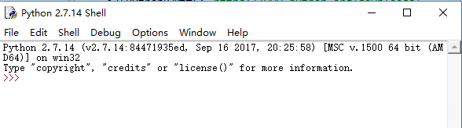
  - 在Python2.7.14中输入`print "hello,Python!你好"`，点击enter查看效果，如：  
  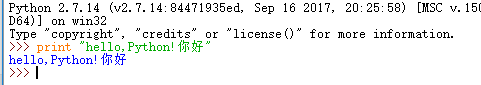  
## 脚本式编程  

- 脚本式编程：通过脚本参数调用解释器开始执行脚本，直到脚本执行完毕，当脚本执行完成后，解释器不再有效。
  - Python脚本文件以`.py`为扩展名，将代码写到文件中(如：test.py)，如：  
  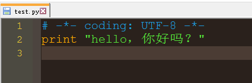  
  如果文件中有中文，需要用`# -*- coding: UTF-8 -*-`转为中文编码，不然不能正常输出）
  - 执行`python C:/Users/thinkpad/Desktop/test.py`(备注：Python已配置在环境变量里面，可直接打开cmd命令，输入该命令行)点击enter可查看结果。
  如：  
  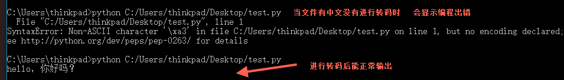  
## Python标识符  

- 在Python中，标识符由字母、数字、下划线组成。  
- 不能以数字开头  
- 标识符区分大小写  
- 以下划线开头的标识符是有特殊意义的  
  - 以单下划线开头`_foo`的代表不能直接访问的属性，需通过类提供的接口进行访问，不能用`from xxx import *`而导入；
  - 以双下划綫开头的`__foo`代表类的私有成员；
  - 以双下划线开头和结尾的`__foo__`代表Python里面特殊方法专用的的标识，如：`__init__()`代表类的构造函数。  
- Python可以同一行显示多条语句，方法是用`;`号隔开。如：  
  
## Python保留字符  

- 保留字不能用作常数或变数，或任何其他标识符名称；  
- 所有Python的保留字字只包含小写字母；  
以下是Python的保留字：  
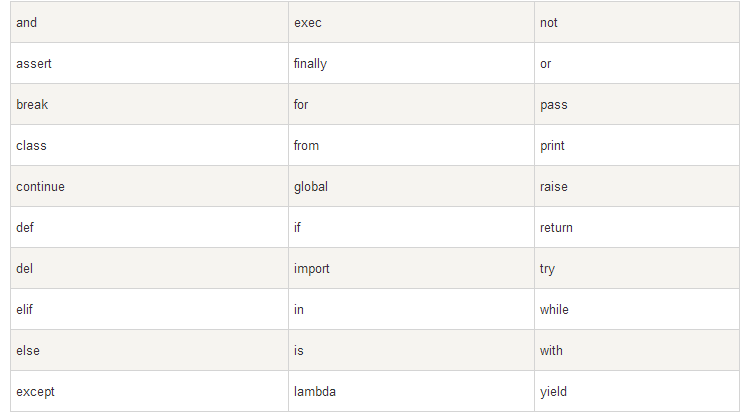  
## 行与缩进

- Python与其他语言最大的区别是，Python的代码块不使用大括号来控制类，函数以及其他逻辑判断，而是**用缩进来写模块**。
- 缩进的空白数量是可变的，但是**所有代码块语句必须包含相同的缩进空白数量**，这个必须严格执行
- 没有严格缩进，在执行时会报`IndentationError`的错。**所以Python对格式要求是非常严格的**，如下代码：  
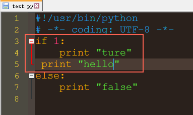  
执行以上代码，会出现如下报错：  
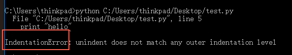  
  - `IndentationError: unindent does not match any outer indentation level`意思是：使用的缩进方式不一致，有的用的是tab缩进，有的用的是空格缩进，改为一致即可。
  - `IndentationError: unexpected indent`意思是文件里格式不对了，可能是tab和空格没对齐的原因。
- Python的代码块中必须使用相同数目的行首缩进空格数，建议在每个缩进层次使用单个制表符（tab缩进）或两个空格符或四个空格，但**切记不能混用**。
## 多行语句

- Python语句中一般以新行作为语句的结束符。使用**斜杠（/）**将一行的语句分为多行显示，语句中包涵`[]`、`{}`、或`()`括号就不需要使用多行连接符。如：  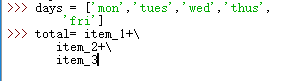		
## Python引号  

- Python可以使用引号（`'`）双引号（`"`）、三引号（`'''`或`"""`）来表示字符串，引号的开始与结束必须是相同类型的。
- 三引号可以由多行组成，编写多行文本的快捷语法，常用于文档字符串，在文件的特定地点，被当做注释。如：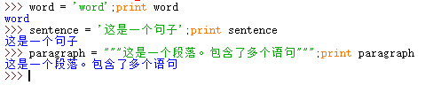  
## Python注释  

- Python中单行注释采用“`#`”开头。	
- 多行注释使用三个单引号（`'''`）或三个双引号（`"""`）	
## Python空行  
 
- 函数之间或类的方法之间用空行分隔，表示一段新的代码的开始。
- 类和函数入口之间也用一行空行分隔，以突出函数入口的开始。
- 空格的作用在于分隔两段不同功能或含义的代码，便于日后代码的维护或重构。注：**空行也是程序代码的一部分**
##等待用户输入  

- 输入代码`raw_input("\n\nPress the enter key to exit.")`,执行后就会等待用户输入，按回车键后就会退出。如：  
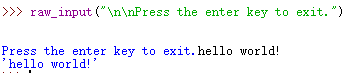  
- “\n\n”在结果输出前会输出两个新的空行，一旦用户按下enter键退出，其他键显示。
##同一行显示多条语句、输出语句  

- Python可以在同一行中使用多条语句，语句之间使用分号（`;`）分隔。
- 输出语句：`print`，默认输出是换行的，如果要实现不换行需要再变量末尾加上逗号，如：  
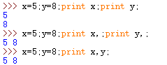  
## 多个语句构成代码组

- 缩进相同的一组语句构成一个代码块，我们称之为代码组。
- 像`if`、`while`、`def`、`class`这样的复合语句，以冒号（`:`）结束，该行之后的一行或多行代码构成代码组。
- 首行及后面的代码组称为一个子句（clause）  
## 命令行参数  
 
- Python用`-h`参数查看个参数的帮助信息：`python -h`  
# python变量类型  

##变量赋值

- Python中的变量赋值不需要类型声明。
- 每个变量在内存中创建，都包括变量的标识、名称和数据这些信息
- 每个变量在使用前都必须赋值，变量赋值以后该变量才会被创建。
- 等号（=）用来给变量赋值
- Python允许多个变量赋值，如：`a=b=c=1`或`a,b,c=1,2,"Tom"`  
## 标准数据类型  

- Numbers（数字）  
  - 数字数据类型用于存储数值。它支持四种不同的数字类型：  
    - int（有符号整型）
    - long（长整型）
    - float（浮点型）
    - complex（复数）
- String（字符串）  
- List（列表）  
- Tuple（元组）  
- Dictionary（字典）   
  																			

